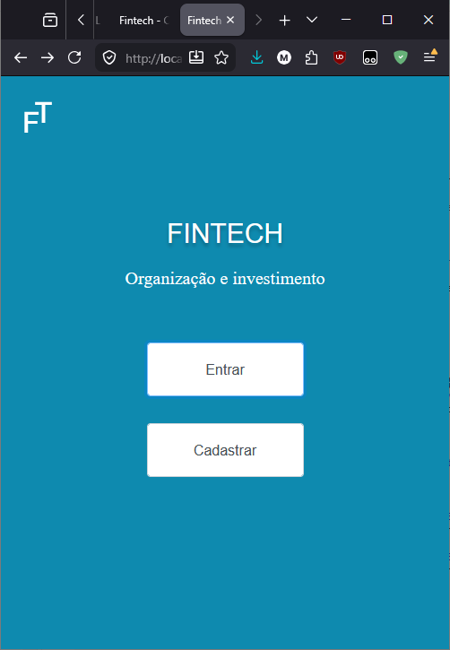
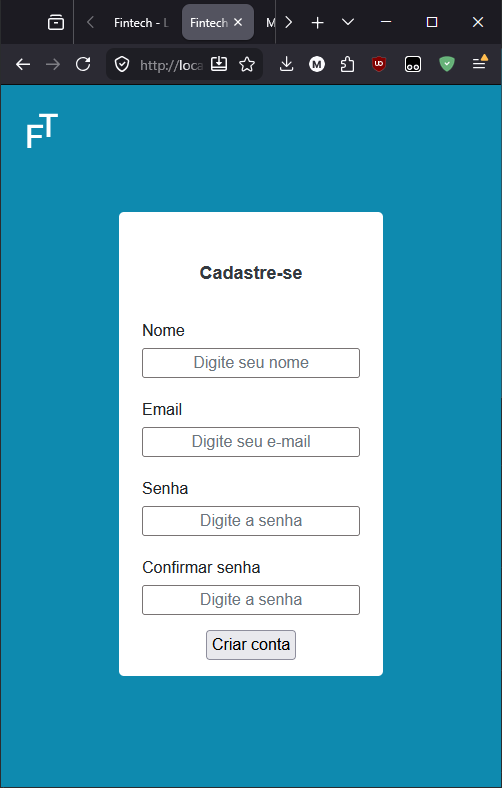
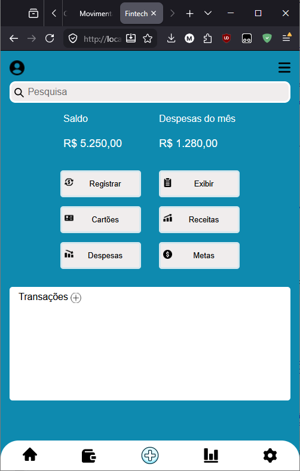
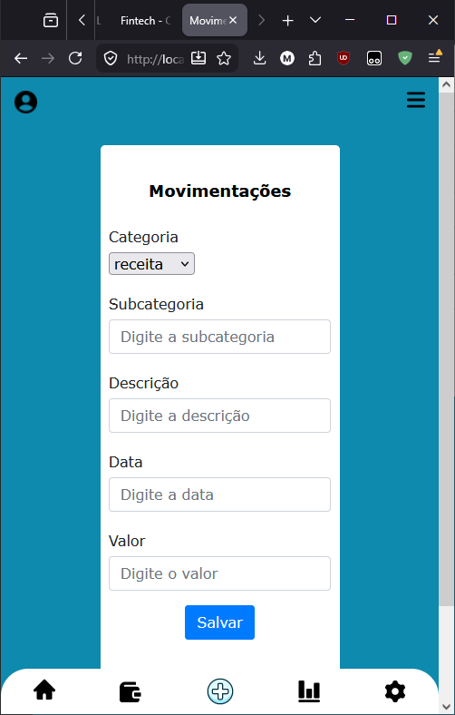
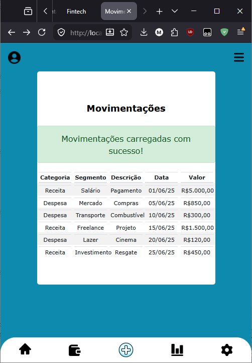

# 💰 Fintech TGW

Sistema Web para gerenciamento financeiro pessoal desenvolvido em Java durante o curso de Análise e Desenvolvimento de Sistemas.

O projeto permite o cadastro de usuários, autenticação de login, gerenciamento de movimentações financeiras e visualização de indicadores financeiros através de um painel de controle.

---

# 📸 Screenshots

## Tela de Login



## Cadastro de Usuário



## Painel de Controle



## Cadastro de Movimentação



## Listagem de Movimentações



---

# 🚀 Funcionalidades

- Cadastro de usuários
- Autenticação de login
- Cadastro de movimentações financeiras
- Consulta de movimentações
- Edição de movimentações
- Exclusão de movimentações
- Controle de receitas
- Controle de despesas
- Dashboard financeiro
- Cálculo automático de totais

---

# 🏗️ Arquitetura

O sistema foi desenvolvido utilizando o padrão MVC (Model-View-Controller).

```text
View (JSP)
    ↓
Controller (Servlet)
    ↓
DAO (Data Access Object)
    ↓
Oracle Database
```

---

# 🛠️ Tecnologias Utilizadas

## Backend

- Java 17
- JSP (Java Server Pages)
- Servlets
- JDBC
- DAO Pattern
- MVC Pattern

## Banco de Dados

- Oracle Database
- SQL
- Sequences Oracle
- JDBC Driver

## Frontend

- HTML5
- CSS3
- JSP

## Servidor de Aplicação

- Apache Tomcat 9

## IDE

- Eclipse IDE

---

# 📂 Estrutura do Projeto

```text
src/main/java
│
├── bean
│   ├── Cadastro
│   └── Movimentacao
│
├── controller
│   ├── servletLogin
│   ├── servletCadastro
│   └── MovimentacaoServlet
│
├── dao
│   ├── CadastroDAO
│   ├── MovimentacaoDAO
│   └── ConsultaDAO
│
├── dao/impl
│   ├── OracleCadastroDAO
│   ├── OracleMovimentacaoDAO
│   └── OracleConsultaDAO
│
├── factory
│   └── DAOFactory
│
├── singleton
│   └── ConnectionManager
│
├── filter
│   └── LoginFilter
│
└── exception
```

---

# 🔄 Fluxo da Aplicação

1. Usuário realiza login no sistema.
2. O Servlet recebe a requisição.
3. O DAO executa as operações no banco Oracle.
4. Os dados são processados.
5. O resultado é exibido através das páginas JSP.

---

# 🗄️ Banco de Dados

O projeto foi originalmente desenvolvido utilizando Oracle Database e JDBC para persistência dos dados.

Principais entidades:

- T_CADASTRO
- T_MOV

---

# 🎯 Objetivos do Projeto

Este projeto teve como objetivo praticar:

- Programação Orientada a Objetos (POO)
- Desenvolvimento Web com Java
- Arquitetura MVC
- Persistência de dados com JDBC
- Integração com Oracle Database
- Padrão DAO
- Manipulação de formulários JSP

---

# ⚠️ Observações

Este projeto foi desenvolvido em ambiente acadêmico utilizando Oracle Database disponibilizado pela instituição de ensino.

Atualmente o ambiente original não está mais disponível, porém o código-fonte completo e a estrutura da aplicação foram preservados para fins de estudo, demonstração técnica e composição de portfólio.
